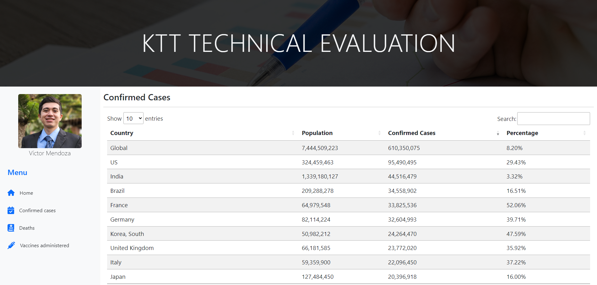
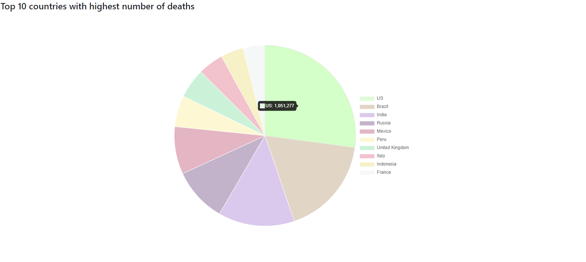

# KTT Technical Evaluation

This is a mini-project for displaying information about the ongoing COVID-19 pandemic. In this website you will find: confirmed cases, number of deaths and vaccines administered per country. All conveniently displayed in an interactive table!

## Installation


Download the source code and make sure you have Node.js installed on your computer.

Install all dependencies using the following command inside the project folder:

```
> npm install
```

Then run the local server:

```
> npm start
```

That's it! now you can test the website by just typing **localhost:3000** on your browser.

## What you will find


This site contains three main pages:

- **Confirmed Cases:** Here you will see confirmed cases per country, alongside that country's population and the percentage that has been infected with covid-19.

- **Deaths:** Number of deaths per country caused by covid-19.
  
- **Vaccines Administered:** This table shows the total of vaccines administered, people vaccinated and people partially vaccinated per country.

At the end of each page you will find a pie chart with the top 10 countries of each topic.

## How it was made

All the data is fetch in real time from [M-Media-Group Covid-19 API](https://github.com/M-Media-Group/Covid-19-API)

Node.js (*v16.14.2*) with Express was used for the backend. A complete list of the libraries used, alongside their versions can be found in the package.json file.

To make the frontend nice-looking, a couple of libraries where implemented:

- Bootstrap 5.2 
- Font Awesome Icons
- AOS (Animate On Scroll)
- DataTables
- Chart.js

## Known issues

There are a couple of problems related to the underlying API the website uses to gather all the information.

1. Confirmed cases could throw an error when accessed. This is because the route /cases from the API where the data is fetched, seems to stop working randomly. This may be because the API has a limited amounts of calls each day but I am not really sure. If it does not work check again in a couple of hours.
   
2. Because /cases does not work all the time, I decided to get the number of deaths from /history?status=deaths. This is more a workaround rather than an issue.
   
3. Sometimes the API will freeze when a request is made. Just refresh de page and everything should work perfectly.

## Screenshots

### Confirmed cases



### Number of deaths chart


